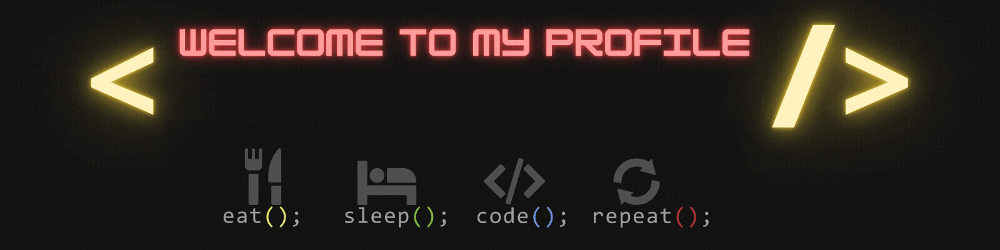

  <h2><strong>Software Developer || Apasionado por el Game Developer</strong></h2>
   
  <strong>Estudiante de 42 Málaga</strong>

## ¿Qué tecnologías domino?  

  
  
  
  
  

## Mis proyectos más interesantes (de momento)

  
🎮 <a href="https://noa42.itch.io/croakscape">Juego en Unity</a> - Un juego creado en 48h en la MálagaJam 2025 edición 19.

  
🎮 <a href="https://tetsuhi.itch.io/unasombraenelpolo">Juego en Godot</a> - Un juego creado en 48h en la MálagaJam 2024 edición 18.

  
🌐 <a href="https://github.com/BigKevlar/42_Cursus/tree/master/017_webserv">Servidor web en C</a> - Implementación de un servidor HTTP escrito en C.

## Mis estadísticas

  
  

## Contacta conmigo a través de...

  

